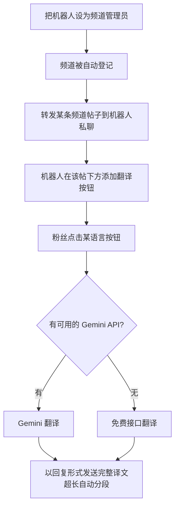

# Yaraav 翻译管理机器人（中文版）

一个部署在 **Cloudflare Workers** 上的 Telegram 频道多语言翻译管理机器人。频道主把机器人设为频道管理员后，可以给频道帖子加上「多语言翻译按钮」，粉丝点击即可看到该帖子的**完整翻译**（支持中文 / 英文 / 波斯语 / 俄语）。翻译引擎优先使用用户自己的 **Google Gemini API**，未配置时自动回退到免费翻译接口。

> 由 **培哥** 制作并维护。

## 功能特性

- **频道翻译按钮**：把频道帖子转发给机器人，即可在原帖下方生成翻译按钮。
- **完整长文翻译**：译文以「回复原帖」的消息形式发送，支持任意长度（超过 4096 字符自动分段），不再受弹窗字数限制。
- **多语言支持**：🇨🇳 中文 / 🇬🇧 English / 🇮🇷 فارسی / 🇷🇺 Русский。
- **智能 API 选择**：频道帖子的翻译按钮会优先使用该频道所有者登记的 Gemini 密钥，粉丝无需配置。
- **Gemini + 免费接口双引擎**：Gemini 失败时自动回退 Google 免费翻译。
- **强制加入频道**：可要求用户先加入指定频道才能使用。
- **频道自动登记**：机器人被设为频道管理员时自动识别，被移除时自动清理。
- **用户系统**：注册申请 → 所有者审核（可接受/拒绝）→ 用户名密码登录。
- **所有者管理面板**：用户管理、强制加入设置、API 管理。

## 工作流程



## 前置条件

- 一个 Telegram Bot（找 [@BotFather](https://t.me/BotFather) 创建，获取 Token）。
- 一个 Cloudflare 账号。
- 可选：Google Gemini API 密钥（[Google AI Studio](https://aistudio.google.com) 免费获取），不填则用免费翻译接口。

## 配置

编辑 `index.js` 顶部的 `CONFIG`：

| 字段 | 说明 |
|------|------|
| `TELEGRAM_TOKEN` | BotFather 给的 Bot Token |
| `OWNER_ID` | 所有者（管理员）的数字 ID（用 [@userinfobot](https://t.me/userinfobot) 查询） |

## 部署步骤

1. 在 Cloudflare 新建一个 Worker，把 `index.js` 内容粘贴进去。
2. 创建一个 **KV 命名空间**，绑定名必须为 `YARAAV_DB`（代码中写死）。
3. 填好 `CONFIG` 后部署，获取 Worker 网址。
4. 设置 Telegram Webhook（浏览器打开，替换成你的值）：
   ```
   https://api.telegram.org/bot<你的Token>/setWebhook?url=<你的Worker网址>
   ```

## 使用方法

1. 在你的频道里把机器人设为**管理员**（需要「编辑消息」权限）。
2. 把想要加翻译的频道帖子**转发到机器人私聊**。
3. 机器人会在原帖下方加上翻译按钮，粉丝点击即可看到完整译文。

## 优点

- **零成本可跑**：Cloudflare Workers + KV 免费额度即可运行，未配置 Gemini 也能用免费接口翻译。
- **对粉丝零门槛**：翻译用的是频道主的 API，粉丝直接点按钮就行。
- **完整译文**：改造后不再受 Telegram 弹窗约 200 字符限制，长文自动分段发送。
- **结构清晰**：单文件、模块分区明确，易于二次开发。

## 已知限制与改进建议

- **密码明文存储**：用户密码以明文存于 KV，所有者面板可明文查看。正式对外使用建议改为哈希（如 SHA-256）存储。
- **无频道级 API 绑定落地**：界面有「为频道单独设置 API」入口，但当前逻辑统一取所有者的第一个密钥，未按频道区分。
- **无速率限制**：高频点击翻译可能触发 Gemini/免费接口的限流，建议后续加缓存或节流。
- **免费回退接口非官方**：`translate.googleapis.com` 免费端点稳定性无保证，重度使用请配置正规 Gemini API。

## 联系方式

- 频道：[@pgkj666](https://t.me/pgkj666)
- 联系机器人：[@pgkj666_bot](https://t.me/pgkj666_bot)

## 许可证

[MIT](LICENSE) © 2026 培哥
